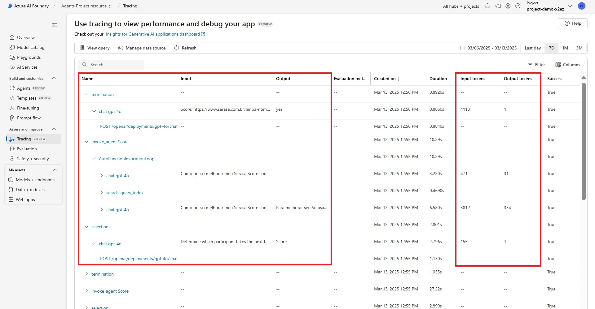

#  Azure AI Foundry and Semantic Kernel for a MultiAgent application

This directory contains Jupyter notebooks for hands-on exercises with Azure AI Foundry.

## 🔧 1. Prerequisites

+ [azd](https://learn.microsoft.com/azure/developer/azure-developer-cli/install-azd), used to deploy all Azure resources and assets used in this sample.

+ [azure functions core tools](https://learn.microsoft.com/en-us/azure/azure-functions/functions-run-local?tabs=windows%2Cisolated-process%2Cnode-v4%2Cpython-v2%2Chttp-trigger%2Ccontainer-apps&pivots=programming-language-csharp)

+ [PowerShell Core pwsh](https://github.com/PowerShell/powershell/releases) if using Windows

+ [Python 3.11](https://www.python.org/downloads/release/python-3110/)

## 🔧 2. Infrastructure Creation

This sample uses [`azd`](https://learn.microsoft.com/azure/developer/azure-developer-cli/) and a bicep template to deploy all Azure resources:

1. Login to your Azure account: `azd auth login`

2. Create an environment: `azd env new`

3. Place documents for testing inside [data](./data/) folder 

4. Run `azd up`.

   + Choose your Azure subscription.
   + Enter a region for the resources.

   The deployment creates multiple Azure resources and runs multiple jobs. It takes several minutes to complete. The deployment is complete when you get a command line notification stating "SUCCESS: Your up workflow to provision and deploy to Azure completed."

## 🔧 3. Architecture 

-  **Document Storage and Indexing (Offline):**
   - Source documents (for example, Markdown or PDF files) are placed in an Azure Storage Account.
   - An Azure AI Search indexer job ingests these documents and creates a searchable index in Azure AI Search.
   - This indexing step happens on a scheduled or as‐needed basis, so it is considered “offline.”

- **Semantic Kernel Multi Agent App:**
   - At query time, the Semantic Kernel acts as the orchestrator.
   - When a user asks, “What are the benefits of credit card X?” the Semantic Kernel can call multiple “AI Plugins” to enrich its response.
   - AI Plugins might include:
      - Azure AI Search: Looks up relevant content in the indexed documents.
      - Azure Bing Search: Searches the public web for additional context.
      - Azure AI Foundry: Provides LLM reasoning and summarization.

- **Logging and Monitoring:**
   - All interactions and plugin calls are tracked in Azure Application Insights for operational visibility and performance monitoring.

- **Hosting and Deployment:**
   - The final application can be hosted on Azure App Service, in containerized environments with Azure Container Apps.


## 🚀 4. Run the Indexig Document
- Place documents (.pdf or markdown) inside [data](data/) folder. 

- Execute the [1-create-index.ipynb](notebooks/1-create-index.ipynb) to create the indices that will be used by the Agents. 

- Each document inside the [data](data/) is mapped to a different index inside the same Azure Search resource, as below:


## 🚀 5. Running MultiAgent Chat - One conversation
- In [main](main.py) , we create multiple agents and then orchestrate them using [Semantic Kernel](https://learn.microsoft.com/en-us/semantic-kernel/overview/) and single-Turn, so that a specific agent is designated to provide a response

- To run the application and start a chat:
```bash
python main.py
```

## 🚀 6. Running MultiAgent Chat - Multiple conversations

### Run the sample conversations
```bash
python scripts/run_conversations.py
```
   - You may edit the sample conversations [here](./config/user_inputs.py)

### Observe the Logs from Azure AI Foundry Project Traces


   - Traces provide full observability of all agent steps, including selecting the agent to answer (selection step in the image), executing the chosen agent’s tool (invoke_agent Score step in the image), and making the final decision on whether the user’s query was answered (termination step in the image).

### Get the Total Tokens from Azure AI Foundry Project Monitoring


   - This dashboard shows total token consumption for the sample conversations in [here](./config/user_inputs.py). This tokens include all calls to the Azure Open AI Service made by the multi agent chat. 

## 💣 7. Deleting Infrastructure

You can delete the infrastruture created before by using `azd down --purge`
  
